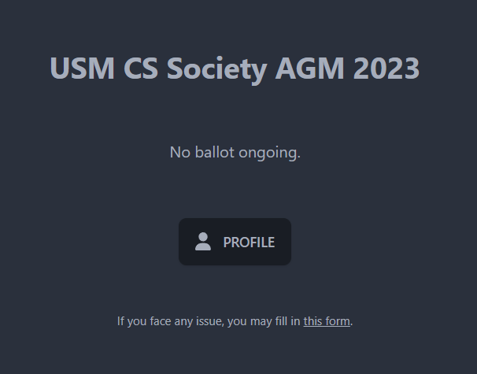

# Svelte Voting Platform

A voting platform built with Svelte 3.



## Features
* Dynamic Voting System: Easily create and manage polls and votes
* Real-Time Updates: Instant feedback and live updates
* Intuitive User Interface: Minimal and user-friendly design
* Backup Password Login (Add `?password` to the URL)

> [!WARNING]
> This project is using an older version of Svelte and are not fully tested in the current state.

## Setup

> [!TIP]
> Use `us-central1` for the region in Firebase Functions to avoid CORS issues and get no-cost quota for Cloud Storage.

### Initial Setup
1. Clone the repository and install dependencies
2. Create a Firebase project and change to Blaze pricing
3. Initialize **Authentication** with Email/Password authentication with Passwordless sign-in
4. Initialize **Realtime Database**
5. In Realtime Database, copy the contents `database.rules.json` to the database rules
6. Initialize **Storage** and set the rules to the following:
```
rules_version = '2';
service firebase.storage {
  match /b/{bucket}/o {
    match /{allPaths=**} {
      allow read: if request.auth != null;
      allow write: if request.auth.token.admin;
    }
  }
}
```
6. Setup a web app (Settings > General > Your apps) and copy the `firebaseConfig` at `src/firebase.ts`

### Authorized Email
1. Create a Google Sheets and list all authorized emails that can login in the first column (row-by-row)
2. Go to "File" > "Share" > "Publish to the web"
3. Select the sheet and change the type to "Comma-separated values (.csv)"
4. Copy the link and paste it in `functions/src/index.ts` at `AUTHORIZED_LIST`
5. In `setGlobalOptions` function, change the `region` if different and `maxInstances` or `concurrency` if needed
6. If needed, uncomment the line after `checkEmail` to check if the email contains the authorized domain

### Deploy Functions
1. Install [Firebase CLI](https://firebase.google.com/docs/functions/get-started?gen=2nd#set-up-your-environment-and-the-firebase-cli)
2. Run `firebase login` to login to your Firebase account (if not already)
3. Run `firebase init functions`, select "Overwrite" > "TypeScript" > default for rest
4. Run `firebase deploy --only functions` to deploy the functions
5. In Firebase Console > **Authentication**, Go to Settings > Blocking functions (need to upgrade) and set to `blockUnauthorized`
  
### Set Admin
1. Generate a service account key at: [Firebase Admin SDK](https://firebase.google.com/docs/admin/setup#initialize_the_sdk_in_non-google_environments)
2. Copy the file to the root directory and rename it to `serviceAccountKey.json`
3. You can now set a user as admin by running `npx tsx setAdmin.ts add <email>` in the root directory, other commands include remove, check, and list

### Pre-Deploy
* Modify the initial login text in `src/components/Login.svelte` (such as raising a ticket)
* Modify the title and footer in `src/routes/+page.svelte`
* Modify the form input in `src/routes/profile/+page.svelte`

### Deployment
You may need to change the adapters if deployment fails.
* [Cloudflare Pages](https://developers.cloudflare.com/pages/framework-guides/deploy-a-svelte-kit-site/#sveltekit-cloudflare-configuration/) - Allows private repository
* [Vercel](https://vercel.com/docs/frameworks/sveltekit)
* [Netlify](https://docs.netlify.com/frameworks/sveltekit/)

See [SvelteKit documentation](https://svelte.dev/docs/kit/adapters) for more information on deployment adapters.